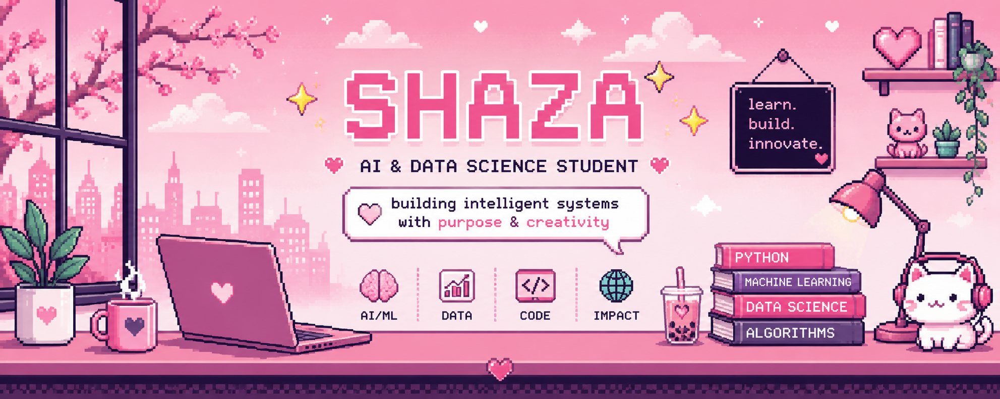
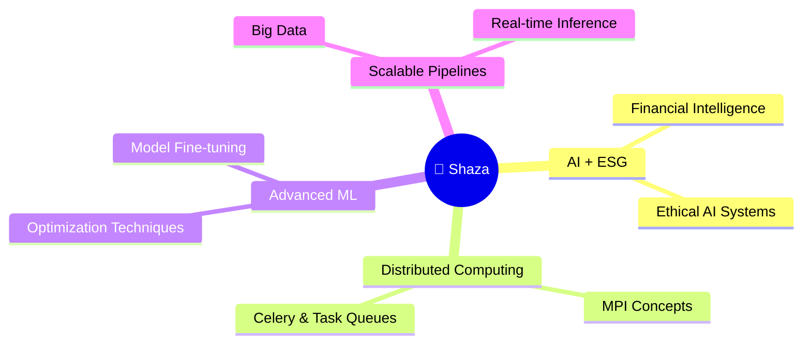

<div align="center">

<!-- ✨ ANIMATED HEADER BANNER ✨ -->
<p align="center">
  
</p>
</div>

<br/>

<div align="center">

<!-- 🎀 SOCIAL BADGES -->
[](https://my-portfolio-shaza-saad.vercel.app)
[](https://www.linkedin.com/in/shaza-saad-7549b62a0)
[](mailto:shazalugman@gmail.com)

</div>

<br/>
---


<br/>
---

## 🌸 About Me


> *"Turning data into decisions, and models into meaningful systems."*

🎓 I'm a **Data Science & AI graduate** passionate about building intelligent, data-driven systems that go from **idea → model → deployment**.

💡 My world revolves around:
- 🤖 **Machine Learning** & Predictive Modeling
- 🧠 **Natural Language Processing** (NLP)
- 📊 **Data Science** & Statistical Analysis
- ⚙️ **Optimization** & Intelligent Systems Design

🚀 I love turning raw, messy data into structured insight — and structured insight into working systems that make a difference.

<br clear="right"/>

---

## 🚀 Currently Building

<div align="center">

| 🌟 Project | 📌 Description | 🔧 Stack |
|:---:|:---|:---|
| **🧠 StoCast** | ESG-aware stock forecasting with NLP + time-series | Python · Scikit-learn · FastAPI |
| **📊 ML Pipelines** | Classification, regression & real-world datasets | Pandas · NumPy · PyTorch |
| **⚙️ AI Systems** | Scalable intelligent systems + optimization | Docker · AWS · Celery |

</div>

<br/>

<div align="center">

</div>

---

## 🌟 Featured Project — StoCast

<div align="center">

```
╔══════════════════════════════════════════════════════════╗
║          🧠  S t o C a s t  —  AI Stock Forecasting      ║
║    Market Data · ESG Signals · NLP Sentiment Analysis    ║
╚══════════════════════════════════════════════════════════╝
```

</div>

An AI-powered financial intelligence platform combining **market signals + ESG ethics + NLP sentiment**.

<table>
<tr>
<td>

**✨ Key Features**
- 📈 Time-series stock forecasting
- 🧠 NLP sentiment on financial news  
- 🌍 ESG insights for ethical investments
- ⚙️ Modular, scalable ML pipeline

</td>
<td>

**🛠️ Tech Stack**


</td>
</tr>
</table>

---

## 🧰 Technical Stack

<div align="center">

### 🧠 Core Languages


### 🛠️ Frameworks & Development


### ☁️ Cloud & DevOps


### 🗄️ Databases


### 📊 Data & AI Stack


</div>

<br/>

<div align="center">

**Analytics & BI**


**Other Skills**


</div>

---

## 📊 GitHub Analytics

<div align="center">


<br/>


&nbsp;


<br/><br/>


</div>

---

## 🌱 Currently Exploring

<div align="center">



</div>

---

## 💬 Philosophy

<div align="center">

<br/>

> 🌸 *"Turning data into decisions, and models into meaningful systems."*

<br/>

*I believe in building AI that's not only intelligent — but ethical, interpretable, and impactful.*

<br/>

</div>

---

<!-- 🌸 ANIMATED FOOTER -->


</div>